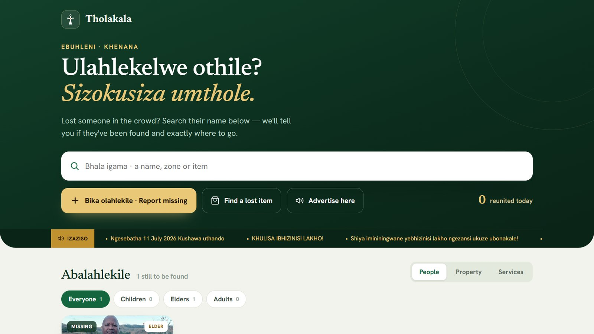

# Tholakala

A missing-persons and lost-property platform for large gatherings. Built for the annual pilgrimage
of iBandla lamaNazaretha (the Nazareth Baptist Church) at Ebuhleni, where tens of thousands of
people arrive over a few days and, inevitably, some of them get separated.

[tholakala.app](https://tholakala.app)



## The problem, stated properly

At that scale the bottleneck isn't the database. It's that a worried person and the person looking
for them are standing three hundred metres apart with no shared channel, and the only
infrastructure between them is a steward with a phone and patchy signal.

So the design starts from the steward, not the app.

## The parts

**Steward console** (`tholakala-console`) — a Next.js app used by trained stewards at physical Help
Points. Case intake, photo upload, matching, handover, property claims, and an audit trail. Built
mobile-first because it's used standing up, and offline-tolerant because signal at the site is not
reliable: writes queue locally and replay when the connection returns.

**Field app** (`tholakala-app`) — a Flutter build of the same core flows for stewards moving around
the grounds.

**Public site** — a mobile-first page where anyone can browse open cases and submit a report
without an account.

## The rule that shapes the product

**Found adults and found children are handled differently, always.**

A capable adult who has been found can have a finder's contact number published, because an adult
can consent to being contacted and can walk away from a bad interaction.

A child never can. So a found child is never listed with a contact number and never routed to a
direct meeting. A child goes to a Help Point, and the handover is done in person by a steward, who
verifies the collecting adult and records the handover. `HandoverModal.tsx` exists because that
step needs to be deliberate, logged, and impossible to skip by accident.

Pre-registration QR wristbands let a parent register a child before the crowd forms, so a found
child arrives at a Help Point already identified.

## Lost property

The item's own description is the proof of ownership. Nobody publishes a photo of a found wallet
with its contents visible and waits for the first person to claim it. The claimant describes what
they lost; the steward checks the description against the item. A matching engine runs the same
comparison automatically between open missing reports and found reports and surfaces likely pairs
for a steward to confirm.

## Izwi

A directives channel for church leadership — announcements published to the public surfaces and to
unattended display screens at the site, in isiZulu.

## Architecture

```
tholakala-console/
  app/api/       cases, claims, property, helppoints, stewards, sites,
                 adverts, izwi, photo, blob/upload, audit/export, auth, report
  app/console/   the steward workspace
  components/    CaseDrawer, HandoverModal, PropertyView, HelpPointsView, Composer…
  lib/           auth, db, actor, photo, offlineQueue, offlineWrites, optimistic
tholakala-app/   Flutter: api, app_state, local_store, models, ui/
```

Offline handling is in three files by design: `offlineQueue` holds the queued writes,
`offlineWrites` knows how to replay each kind, and `optimistic` decides what the steward sees in
the meantime. Keeping them separate is what stops "it worked in the office" from becoming "it
lost a case at the site".

Every mutating route records an actor. The audit export exists because a platform that moves
children between adults has to be able to answer "who did what" afterwards.

## Stack

| | |
| --- | --- |
| Console | Next.js 16, React 19, TypeScript |
| Database | Neon Postgres (serverless driver) |
| Photos | Vercel Blob, with a server-side upload route |
| Field app | Flutter |
| Auth | Password-based steward accounts, session cookies, role guards |
| Hosting | Vercel |

## Identity

The logo is the Shembe cross, traced from a photograph into a vector with `potrace` and a
connected-component cleanup pass to strip the JPEG edge artefacts. Deep green and gold.

## Status

In build. The console and the Flutter app both exist and run; the platform is not yet live for a
full pilgrimage.

---

<sub>Source is private — this repo is the write-up. [Shaun Madondo](https://github.com/TheC0deJunkie) · Durban, KwaZulu-Natal.</sub>
